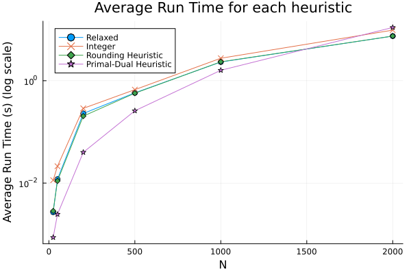
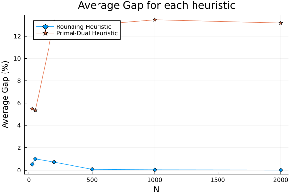
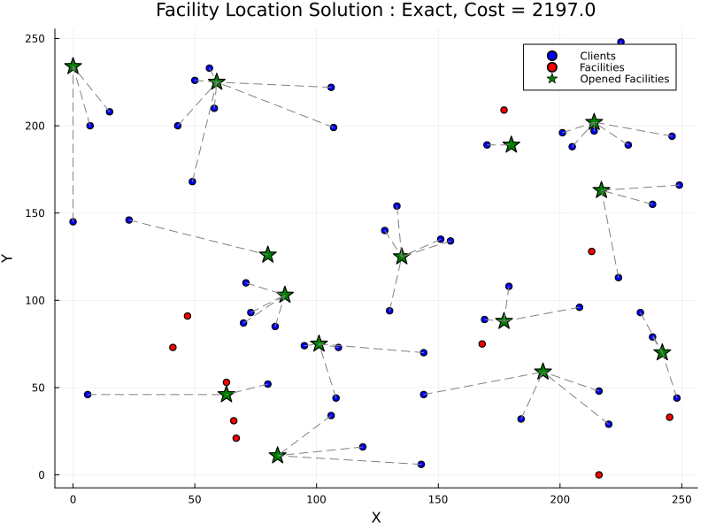
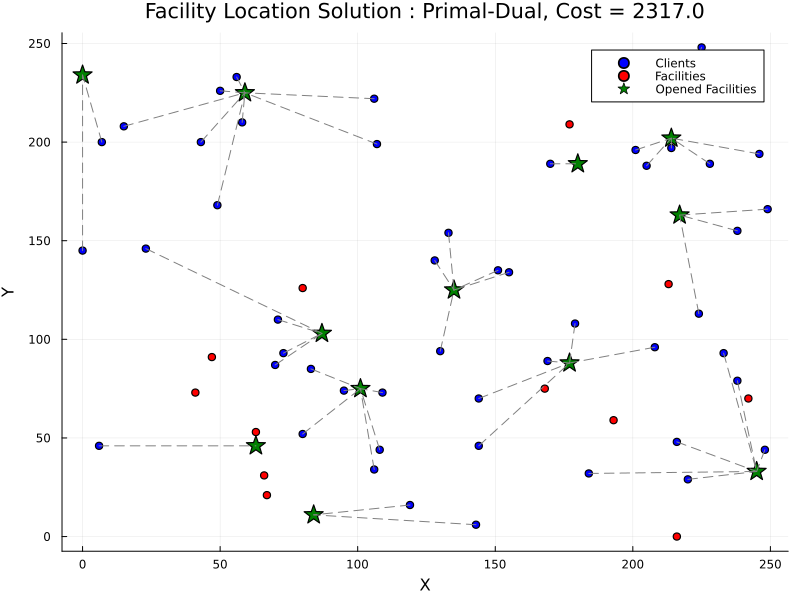

# Facility Location Problem

This repo implements two heuristics and an exact method to solve the facility location problem.  
- `src/data.jl`: Definition of the `Data` struct, and generation of random instances.
- `src/exact.jl`: Exact method to solve the problem using Gurobi.
- `src/rounding.jl`: Rounding heuristic
- `src/primal-dual.jl`: Primal-dual heuristic
- `main.ipynb`: Some other bits of code to find intresting seeds for the random instance generator, and to compare the two heuristics on a few instances.

# Results

The following table give the results obtained on a few instances. We selected instances that specifically have a non-zero integrality gap, to show the difference between the two heuristics, and then added some other randomly generated instances (with zero integrality gap, like the vast majority of randomly generated instances).

- On the instances where the integrality gap is zero, the rounding heuristic is optimal as expected.
- However, despite the fact that the primal-dual heuristic is a 3-approximation, in reality it performs much worse than the rounding heuristic (which is a 4-approximation).

| Instance | N | M | Relaxed obj | Time | Integer Obj | Time | Integrality Gap | Rounding heuristic | Time | Primal-Dual Heuristic | Time |
| :----: | -: | -: | -: | -: | -: | -: | -: | -: | -: | -: | -: |
| 1 | 25 | 10 | 1498.5 | 2.9e-03 | 1500 | 5.7e-03 | 1.5 | 1515 | 3.4e-03 | 1510 | 2.3e-04 |
| 2 | 25 | 10 | 2191.5 | 2.8e-03 | 2194 | 5.9e-03 | 2.5 | 2201 | 3.0e-03 | 2287 | 3.8e-04 |
| 3 | 25 | 10 | 1595.0 | 3.4e-03 | 1604 | 6.2e-03 | 9.0 | 1631 | 2.9e-03 | 1865 | 2.7e-04 |
| 4 | 25 | 10 | 1529.0 | 2.8e-03 | 1532 | 5.4e-03 | 3.0 | 1551 | 2.8e-03 | 1818 | 2.4e-04 |
| 5 | 25 | 10 | 1399.0 | 2.7e-03 | 1399 | 4.1e-03 | 0.0 | 1399 | 2.8e-03 | 1399 | 2.5e-04 |
| 6 | 25 | 10 | 1577.0 | 2.5e-03 | 1577 | 3.9e-03 | 0.0 | 1577 | 2.2e-01 | 1687 | 2.6e-04 |
| 7 | 25 | 10 | 1588.0 | 2.6e-03 | 1588 | 3.8e-03 | 0.0 | 1588 | 2.8e-03 | 1808 | 2.7e-04 |
| 8 | 25 | 10 | 1752.0 | 2.6e-03 | 1752 | 3.9e-03 | 0.0 | 1752 | 2.6e-03 | 1797 | 3.5e-04 |
| 9 | 25 | 10 | 1620.0 | 2.7e-03 | 1620 | 3.8e-03 | 0.0 | 1620 | 2.6e-03 | 1648 | 2.9e-04 |
| 10 | 25 | 10 | 1557.0 | 2.6e-03 | 1557 | 3.8e-03 | 0.0 | 1557 | 2.8e-03 | 1592 | 2.4e-04 |
| 11 | 50 | 25 | 2210.0 | 1.2e-02 | 2212 | 1.8e-02 | 2.0 | 2221 | 9.9e-03 | 2339 | 6.1e-04 |
| 12 | 50 | 25 | 2423.5 | 9.9e-03 | 2424 | 1.6e-02 | 0.5 | 2457 | 1.1e-02 | 2766 | 7.8e-04 |
| 13 | 50 | 25 | 2189.5 | 9.5e-03 | 2197 | 2.4e-02 | 7.5 | 2207 | 1.0e-02 | 2317 | 8.3e-04 |
| 14 | 50 | 25 | 2186.5 | 1.0e-02 | 2187 | 1.6e-02 | 0.5 | 2232 | 1.0e-02 | 2398 | 5.8e-04 |
| 15 | 50 | 25 | 2226.0 | 1.0e-02 | 2228 | 1.5e-02 | 2.0 | 2232 | 1.0e-02 | 2325 | 7.4e-04 |
| 16 | 50 | 25 | 2177.0 | 1.0e-02 | 2178 | 1.9e-02 | 1.0 | 2198 | 9.8e-03 | 2457 | 6.1e-04 |
| 17 | 50 | 25 | 2558.5 | 1.0e-02 | 2559 | 1.7e-02 | 0.5 | 2569 | 1.1e-02 | 2603 | 9.0e-04 |
| 18 | 50 | 25 | 2612.0 | 9.6e-03 | 2613 | 1.6e-02 | 1.0 | 2646 | 9.7e-03 | 2699 | 7.0e-04 |
| 19 | 50 | 25 | 2279.0 | 1.0e-02 | 2280 | 1.6e-02 | 1.0 | 2306 | 1.0e-02 | 2430 | 7.7e-04 |
| 20 | 50 | 25 | 2327.5 | 9.8e-03 | 2328 | 1.7e-02 | 0.5 | 2365 | 3.9e-02 | 2559 | 6.7e-04 |
| 21 | 50 | 25 | 2415.0 | 1.0e-02 | 2418 | 1.9e-02 | 3.0 | 2471 | 9.3e-03 | 2539 | 6.6e-04 |
| 22 | 50 | 25 | 2515.5 | 9.4e-03 | 2516 | 1.6e-02 | 0.5 | 2536 | 9.4e-03 | 2661 | 6.6e-04 |
| 23 | 50 | 25 | 2442.5 | 9.3e-03 | 2444 | 2.0e-02 | 1.5 | 2461 | 1.0e-02 | 2547 | 6.7e-04 |
| 24 | 50 | 25 | 2310.5 | 9.9e-03 | 2312 | 1.8e-02 | 1.5 | 2346 | 9.5e-03 | 2390 | 7.2e-04 |
| 25 | 50 | 25 | 2359.5 | 9.6e-03 | 2362 | 1.6e-02 | 2.5 | 2387 | 9.8e-03 | 2704 | 6.4e-04 |
| 26 | 50 | 25 | 2338.5 | 9.8e-03 | 2339 | 1.6e-02 | 0.5 | 2395 | 1.0e-02 | 2592 | 6.5e-04 |
| 27 | 50 | 25 | 2260.0 | 9.9e-03 | 2261 | 2.0e-02 | 1.0 | 2272 | 1.1e-02 | 2282 | 6.7e-04 |
| 28 | 50 | 25 | 2147.0 | 9.3e-03 | 2147 | 1.1e-02 | 0.0 | 2147 | 9.3e-03 | 2175 | 6.4e-04 |
| 29 | 50 | 25 | 2471.0 | 9.4e-03 | 2471 | 1.2e-02 | 0.0 | 2471 | 9.5e-03 | 2535 | 7.4e-04 |
| 30 | 50 | 25 | 2289.0 | 9.5e-03 | 2289 | 1.1e-02 | 0.0 | 2289 | 9.8e-03 | 2386 | 2.9e-02 |
| 31 | 200 | 100 | 5248.0 | 1.8e-01 | 5251 | 7.0e-01 | 3.0 | 5283 | 1.5e-01 | 6111 | 7.2e-03 |
| 32 | 200 | 100 | 5006.5 | 1.6e-01 | 5009 | 5.3e-01 | 2.5 | 5075 | 1.8e-01 | 6020 | 5.8e-03 |
| 33 | 200 | 100 | 4920.0 | 4.1e-01 | 4922 | 3.0e-01 | 2.0 | 4997 | 1.5e-01 | 5831 | 5.0e-03 |
| 34 | 200 | 100 | 5099.0 | 2.2e-01 | 5099 | 1.7e-01 | 0.0 | 5099 | 2.1e-01 | 5752 | 5.6e-03 |
| 35 | 200 | 100 | 5175.0 | 1.5e-01 | 5175 | 3.9e-01 | 0.0 | 5175 | 1.8e-01 | 5527 | 5.6e-03 |
| 36 | 500 | 100 | 10691.0 | 5.0e-01 | 10691 | 7.3e-01 | 0.0 | 10691 | 4.8e-01 | 12358 | 1.7e-02 |
| 37 | 500 | 100 | 10943.5 | 6.5e-01 | 10945 | 5.6e-01 | 1.5 | 10950 | 7.4e-01 | 12104 | 1.8e-02 |
| 38 | 500 | 100 | 10862.0 | 4.7e-01 | 10864 | 7.4e-01 | 2.0 | 10903 | 6.9e-01 | 12370 | 1.7e-02 |
| 39 | 500 | 100 | 11181.0 | 5.0e-01 | 11181 | 7.3e-01 | 0.0 | 11181 | 4.9e-01 | 12740 | 1.7e-02 |
| 40 | 500 | 100 | 10715.0 | 6.7e-01 | 10715 | 5.7e-01 | 0.0 | 10715 | 6.6e-01 | 12530 | 1.7e-02 |
| 41 | 1000 | 200 | 16331.0 | 2.5e+00 | 16332 | 3.4e+00 | 1.0 | 16353 | 2.8e+00 | 18911 | 6.8e-02 |
| 42 | 1000 | 200 | 16325.5 | 3.0e+00 | 16327 | 3.1e+00 | 1.5 | 16341 | 2.7e+00 | 18486 | 7.0e-02 |
| 43 | 1000 | 200 | 16012.0 | 2.9e+00 | 16012 | 3.1e+00 | 0.0 | 16012 | 3.1e+00 | 18917 | 7.3e-02 |
| 44 | 1000 | 200 | 16976.0 | 2.8e+00 | 16976 | 3.4e+00 | 0.0 | 16976 | 2.5e+00 | 19948 | 7.3e-02 |
| 45 | 1000 | 200 | 16948.0 | 2.6e+00 | 16948 | 3.2e+00 | 0.0 | 16948 | 2.9e+00 | 19257 | 8.8e-02 |
| 46 | 2000 | 300 | 26302.0 | 1.0e+01 | 26303 | 1.1e+01 | 1.0 | 26334 | 8.6e+00 | 30594 | 3.5e-01 |
| 47 | 2000 | 300 | 25960.0 | 8.4e+00 | 25960 | 9.6e+00 | 0.0 | 25960 | 9.5e+00 | 29895 | 3.9e-01 |
| 48 | 2000 | 300 | 25919.0 | 8.5e+00 | 25919 | 1.0e+01 | 0.0 | 25919 | 8.3e+00 | 29247 | 3.3e-01 |
| 49 | 2000 | 300 | 26266.0 | 7.9e+00 | 26266 | 1.1e+01 | 0.0 | 26266 | 9.9e+00 | 31108 | 4.0e-01 |
| 50 | 2000 | 300 | 25709.0 | 8.4e+00 | 25709 | 1.0e+01 | 0.0 | 25709 | 9.0e+00 | 30188 | 4.2e-01 |

# Plots

The following two plots, generated from the data in the table above, show the average run time and average gap for each heuristic across all instances.

- We clearly see that while the primal-dual heuristic performs much worse in terms of solution quality, it is much faster, because it does not require a costly computation of the LP relaxation of the problem.
- In fact for the three methods that require computing the LP relaxation (relaxation itself, exact resolution and rounding heuristic),
their run time is almost the same, meaning that the time taken by the heuristics themselves (or the B&B) is negligible compared to the time taken by the LP relaxation, which is the same for all three methods.

## A specific instance

We focus on a specific instance (Instance 13 in the table above) to show the solutions obtained by the exact method, the rounding heuristic and the primal-dual heuristic.

